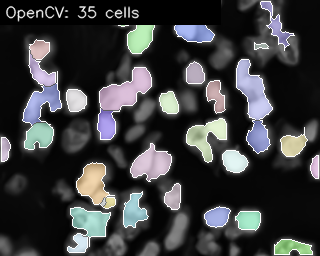
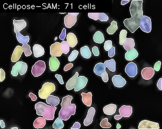

# CellSight — Microscopy Cell/Nuclei Segmentation & Quantification

An end-to-end computer-vision pipeline for **biomedical microscopy**: it enhances
a raw microscopy tile, segments individual cell nuclei **two ways** — a
hand-built OpenCV algorithm and a vision **foundation model (Cellpose-SAM)** —
quantifies per-cell morphology, and benchmarks the two methods against ground
truth.

Built to run on a **CPU-only 8 GB laptop**; the foundation-model step runs on
**free Colab/Kaggle GPU**.

---

## Why this project

It mirrors the exact workflow of a biomedical-imaging CV role: microscopy
segmentation, cell detection, featurization, image enhancement, and fine-tuning
of vision foundation models — with **custom algorithms**, not just off-the-shelf
tools.

| Capability | Where in the code |
|---|---|
| Image enhancement / denoising | [`src/preprocessing.py`](src/preprocessing.py) — illumination correction, CLAHE, Non-Local-Means |
| Custom instance-segmentation algorithm | [`src/classical_pipeline.py`](src/classical_pipeline.py) — marker-controlled watershed |
| Vision foundation model | [`src/cellpose_infer.py`](src/cellpose_infer.py) — Cellpose-SAM (SAM/ViT backbone) |
| Feature extraction / featurization | [`src/featurize.py`](src/featurize.py) — per-cell morphology via `regionprops` |
| Evaluation (Dice / IoU / instance AP) | [`src/evaluate.py`](src/evaluate.py) — DSB-2018 mean-AP metric |
| Interactive demo | [`app/gradio_app.py`](app/gradio_app.py) |

---

## Architecture

```
 raw microscopy tile
        │
        ▼
 ┌─────────────────────┐
 │ preprocessing.py    │  illumination correction → CLAHE → NLM denoise
 └─────────┬───────────┘
           ▼
   ┌───────────────┬────────────────────┐
   ▼                                    ▼
 classical_pipeline.py            cellpose_infer.py
 (custom OpenCV watershed)        (Cellpose-SAM, GPU)
   │                                    │
   └──────────────┬─────────────────────┘
                  ▼
        featurize.py  →  per-cell CSV + summary
                  ▼
        evaluate.py   →  Dice / IoU / mAP vs. ground truth
```

---

## Quickstart

### 1. Install (laptop, CPU)
```bash
python3 -m venv .venv && source .venv/bin/activate
pip install opencv-python-headless scikit-image pandas matplotlib gradio
# Cellpose-SAM is optional locally; install it on Colab/Kaggle instead:
# pip install torch cellpose
```

### 2. Verify it works (no dataset needed)
```bash
python scripts/smoke_test.py      # synthetic nuclei → prints metrics, writes an overlay
```

### 3. Get the dataset (free)
- **2018 Data Science Bowl nuclei** (Kaggle: `data-science-bowl-2018`) — unzip
  `stage1_train` into `data/`.
- Backup: **BBBC039** (Broad Bioimage Benchmark Collection, free download).

### 4. Run the pipeline
```bash
# Custom OpenCV pipeline only (CPU):
python scripts/run_pipeline.py --data data/stage1_train --limit 5

# Add the Cellpose-SAM foundation model (best on Colab/Kaggle GPU):
python scripts/run_pipeline.py --data data/stage1_train --limit 5 --cellpose --gpu
```
Outputs: colored overlays (`outputs/overlays/`), per-cell CSVs
(`outputs/features/`), and a metrics table (`outputs/results.csv`,
`outputs/summary_metrics.csv`).

### 5. Demo
```bash
python app/gradio_app.py            # local UI
python app/gradio_app.py --share    # public link (for the video)
```

---

## Free compute strategy (8 GB laptop, no GPU)

| Step | Where |
|---|---|
| Enhancement, watershed, featurization, evaluation, demo | **Local** (CPU-light on ≤512 px tiles) |
| Cellpose-SAM inference + optional light fine-tune | **Google Colab** (free T4) via [`notebooks/cellsight_colab.ipynb`](notebooks/cellsight_colab.ipynb), or **Kaggle** (free P100, 30 h/wk) |

Keep tiles ≤512 px and batch size 1–2 to stay inside free-tier limits.

---

## Results

Measured on the **same 5 real DSB-2018 microscopy tiles**, both methods vs.
ground truth. Custom OpenCV pipeline ran locally (CPU); Cellpose-SAM ran headless
on a free Kaggle kernel ([`kaggle_kernel/`](kaggle_kernel/)).

| Method | Dice | IoU | instance mAP | mean cell-count error |
|---|---|---|---|---|
| **Cellpose-SAM** (foundation model) | **0.889** | **0.804** | **0.482** | **6.6** |
| OpenCV watershed (custom) | 0.78 | 0.64 | 0.22 | 18.6 |

**Insight:** the custom pipeline is competitive on sparse tiles (Dice up to 0.88)
but **under-segments dense clusters**, which craters its instance mAP and
cell-count accuracy. Cellpose-SAM closes exactly that gap — it more than doubles
instance mAP (0.48 vs 0.22) and cuts cell-count error ~3× (6.6 vs 18.6). The
clearest case is a crowded tile with **70** ground-truth nuclei: the watershed
finds **35**, Cellpose-SAM finds **71**. Practical takeaway: a **hybrid** —
cheap classical enhancement + a foundation model where cell density is high.

Dense tile (70 true nuclei) — custom watershed (35 detected) vs. Cellpose-SAM (71):

| OpenCV watershed | Cellpose-SAM |
|---|---|
|  |  |

---

## Honesty note

Cellpose-SAM is a **pretrained foundation model** applied and evaluated here (and
optionally lightly fine-tuned — see the Colab notebook). The **OpenCV watershed
pipeline is original**. Numbers in the results table are reproducible via the
commands above.
